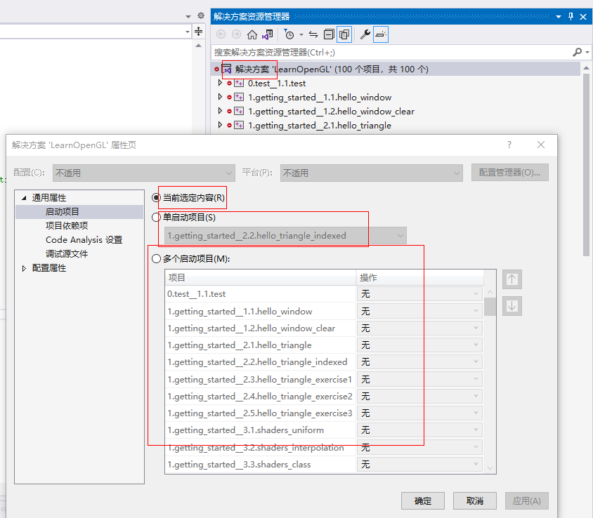

# learnopengl.com code repository
Contains code samples for all chapters of Learn OpenGL and [https://learnopengl.com](https://learnopengl.com). 

## Windows building
All relevant libraries are found in /libs and all DLLs found in /dlls (pre-)compiled for Windows. 
The CMake script knows where to find the libraries so just run CMake script and generate project of choice.

Keep in mind the supplied libraries were generated with a specific compiler version which may or may not work on your system (generating a large batch of link errors). In that case it's advised to build the libraries yourself from the source.

在根目录下执行
```bash
cmake .
```
编译完成后，会在更目录生成一堆文件，用vs 2022打开 LearnOpenGL.sln，在解决方案资源管理器下 解决方案 右击属性，选择要启动的项目


### 有三种方式可供选择
#### 当前选定的内容：打开那个cpp，执行就会运行那个。
#### 单启动项目：每次运行都执行选定的项目
#### 多个启动项目：每次运行都执行选定的多个项目

## Linux building
First make sure you have CMake, Git, and GCC by typing as root (sudo) `apt-get install g++ cmake git` and then get the required packages:
Using root (sudo) and type `apt-get install libsoil-dev libglm-dev libassimp-dev libglew-dev libglfw3-dev libxinerama-dev libxcursor-dev  libxi-dev libfreetype-dev libgl1-mesa-dev xorg-dev` .

**Build through CMake-gui:** The source directory is LearnOpenGL and specify the build directory as LearnOpenGL/build. Creating the build directory within LearnOpenGL is important for linking to the resource files (it also will be ignored by Git). Hit configure and specify your compiler files (Unix Makefiles are recommended), resolve any missing directories or libraries, and then hit generate. Navigate to the build directory (`cd LearnOpenGL/build`) and type `make` in the terminal. This should generate the executables in the respective chapter folders.

**Build through Cmake command line:**
```
cd /path/to/LearnOpenGL
mkdir build && cd build
cmake ..
cmake --build .
```

Note that CodeBlocks or other IDEs may have issues running the programs due to problems finding the shader and resource files, however it should still be able to generate the executables. To work around this problem it is possible to set an environment variable to tell the tutorials where the resource files can be found. The environment variable is named LOGL_ROOT_PATH and may be set to the path to the root of the LearnOpenGL directory tree. For example:

    `export LOGL_ROOT_PATH=/home/user/tutorials/LearnOpenGL`

Running `ls $LOGL_ROOT_PATH` should list, among other things, this README file and the resources directory.

## Mac OS X building
Building on Mac OS X is fairly simple:
```
brew install cmake assimp glm glfw freetype
cmake -S . -B build
cmake --build build -j$(sysctl -n hw.logicalcpu)
```
### build by .sh
```
brew install cmake assimp glm glfw freetype
sh mac_build.sh

```

### run 

The first parameter is the relative path of the program to be executed. Its default value is "bin/1.getting_started/1.getting_started__1.1.hello_window".

```
sh run_mac.sh

sh run_mac.sh bin/1.getting_started/1.getting_started__4.2.textures_combined
```

## Create Xcode project on Mac platform
Thanks [@caochao](https://github.com/caochao):
After cloning the repo, go to the root path of the repo, and run the command below:
```
mkdir xcode
cd xcode
cmake -G Xcode ..
```

## Glitter
Polytonic created a project called [Glitter](https://github.com/Polytonic/Glitter) that is a dead-simple boilerplate for OpenGL. 
Everything you need to run a single LearnOpenGL Project (including all libraries) and just that; nothing more. 
Perfect if you want to follow along with the chapters, without the hassle of having to manually compile and link all third party libraries!
